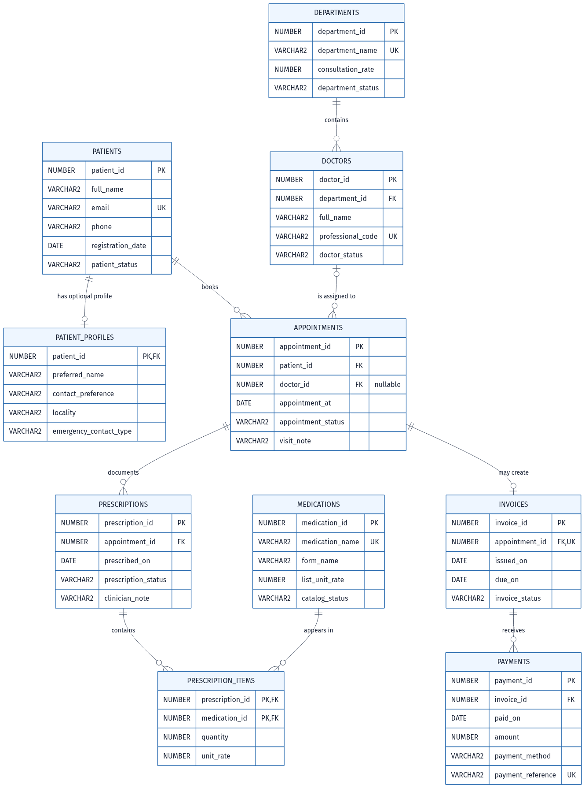

# Healthcare Clinic Database
## Database Management Systems II — Database Programming Report

**Business domain:** Fictional outpatient clinic  
**Platform:** Oracle Database 19c or later; Oracle APEX SQL Workshop  
**Currency:** Thai baht (THB)  
**Group members:** To be completed by submitting students.  
**Scope:** Database design and SQL programming only; no application development.

## 1. Purpose, scope, and execution

This package models a small clinic's patient registration, optional contact profile, departments, doctors, appointments, medication catalogue, prescription orders, invoices, and payments. Every identity, contact, date, visit note, and medication label in the seed data is fictional teaching data; it is not actual health information. A prescription is an order record only. The schema deliberately does **not** represent dispensing, administration, diagnosis, allergy, dose, or clinical instructions.

Exactly ten meaningful tables are used. The SQL script is for a fresh Oracle schema and has no `DROP` statements or destructive resets. Oracle DDL implicitly commits; therefore do not rerun the script over existing objects. In APEX, upload `healthcare.sql` through **SQL Workshop → SQL Scripts**, run it in order, inspect statements and DBMS_OUTPUT, then review the audit queries. SQLcl/SQL*Plus users should enable `SET SERVEROUTPUT ON`.

The script was authored and statically inspected, but **was not executed on an Oracle database**. All expected results below are expectations to be verified by the students in their own Oracle/APEX environment.

## 2. Delivered package

- `healthcare.sql` — one ordered Oracle 19c/APEX script: DDL, seed data, indexes, views, queries, DML, transaction demonstrations, negative tests, audits, and disabled optional roles.
- `healthcare.mmd` — editable Mermaid ERD source with exact key/foreign-key fields and optionality.
- `healthcare.png` — rendered ERD PNG.
- `healthcare_report.md` — this report.

No APEX application, screenshots, MySQL Workbench model, or external database objects are included.

## 3. Schema and seed-data strategy

| Table | Purpose | Primary key | Seed rows |
|---|---|---:|---:|
| patients | Registration identity and basic contact route | patient_id | 10 |
| patient_profiles | Optional shared-PK patient extension | patient_id | 10 |
| departments | Clinic service area and current consultation rate | department_id | 5 |
| doctors | Assigned clinician roster | doctor_id | 5 |
| appointments | Patient visit/booking history | appointment_id | 12 |
| medications | Medication catalogue and current unit rate | medication_id | 5 |
| prescriptions | Appointment-associated order header | prescription_id | 12 |
| prescription_items | Prescription/medication associative lines | prescription_id + medication_id | 14 |
| invoices | Optional one-per-appointment financial document | invoice_id | 12 |
| payments | Receipts against invoices | payment_id | 12 |

Each master/reference table has at least five rows. Every transaction/detail table, including `patient_profiles`, has at least ten. Ten fictional patients and profiles are inserted explicitly. A deterministic PL/SQL loop creates twelve completed visits, associated prescription headers, invoice headers, and payments; two added prescription lines demonstrate a multi-medication order. All dates are Oracle DATE literals, avoiding NLS date-format dependency.

## 4. Relationships and cardinality

### Optional one-to-one relationships

- `patients → patient_profiles` is **one to zero-or-one**. The profile's `patient_id` is both PK and FK. A patient may be registered before their optional profile is completed.
- `appointments → invoices` is **one to zero-or-one**. `invoices.appointment_id` is non-null and UNIQUE, so an invoice belongs to exactly one appointment and no appointment can have two invoice rows. An appointment can exist before invoicing.

### One-to-many relationships

- One patient may have many appointments; each appointment has one patient.
- One department may have many doctors; each doctor belongs to one department.
- One doctor may be assigned to many appointments; `appointments.doctor_id` is nullable after roster deletion.
- One appointment may have multiple prescription headers; each prescription belongs to one appointment.
- One invoice may receive many payment rows; each payment belongs to one invoice.

### Many-to-many relationship

`prescriptions` and `medications` are M:N, resolved by `prescription_items`. The composite PK prevents one medication from being duplicated on the same prescription. `quantity` and `unit_rate` describe that specific ordered medication line.

The ERD accurately marks `doctor_id` as nullable (`FK_NULLABLE`) and the two optional 1:1 relationships. Child minima shown as optional-many describe what the relational constraints can enforce; the script includes diagnostic queries for cross-row completeness but does not falsely claim that a CHECK constraint requires child rows.

## 5. Normalization to 3NF

### First normal form

All columns are atomic. Multiple medications on an order are separate `prescription_items` rows, not a comma-separated medication list. Patients, departments, doctors, invoices, and payments each have separate records.

### Second normal form

Most tables have a single-column key. In composite-key `prescription_items`, `quantity` and `unit_rate` depend on the complete `(prescription_id, medication_id)` pairing, not on medication alone or prescription alone.

### Third normal form

Non-key facts describe their table's key rather than another non-key value:

- `patient_id → full_name, email, phone, registration_date, patient_status`; appointment rows store the patient reference, not copied identity fields.
- The optional profile extends one patient and does not repeat patient identity.
- `department_id → department_name, consultation_rate, department_status`; doctors keep only the department key.
- `doctor_id → professional_code, name, status`; an appointment references the doctor rather than storing clinician data.
- `medication_id → medication_name, form_name, list_unit_rate, catalog_status`; prescription lines retain the historical `unit_rate` fact separately.
- `invoice_id → appointment_id, issued_on, due_on, invoice_status`; patient and department facts come through the appointment relationship.
- `payment_id → invoice_id, paid_on, amount, method, reference`.

Current catalogue rates and historical line rates are intentionally distinct facts. `medications.list_unit_rate` and `departments.consultation_rate` may change, while `prescription_items.unit_rate` preserves the rate recorded on an order line. The model stores no invoice total, paid total, balance, or medication subtotal: those are derived in `v_invoice_summary`. This avoids redundant totals that could become inconsistent.

## 6. Constraints, deletion rules, and limitations

| Mechanism | Examples | Purpose |
|---|---|---|
| PRIMARY KEY | All ten tables; composite prescription item PK | Stable identity and no duplicate medication line per order |
| FOREIGN KEY | Appointment/patient; invoice/appointment; payment/invoice | No orphan related rows |
| NOT NULL | Names, required keys, dates, rates, amounts | Essential facts required |
| UNIQUE | Patient email, department name, doctor code, medication name, invoice appointment, payment reference | Business duplicate prevention |
| DEFAULT | Registration date, statuses, contact preference, quantity, issue dates | Sensible omitted-value behavior |
| CHECK | Status lists, positive rates/quantity/payment, invoice chronology | Domain validation |

`ON DELETE SET NULL` on `appointments.doctor_id` preserves the appointment when a doctor roster row is removed. The patient-to-appointment, appointment-to-invoice, and invoice-to-payment chains are restrictive by default, protecting medical and financial history from cascade deletion.

`ON DELETE CASCADE` is purposely narrow: a profile cannot sensibly survive its patient, and prescription-item rows cannot survive a deleted prescription header. In ordinary operations, parent clinical history should not be deleted; the cascade is explicitly tested only with a temporary draft prescription and rolled back. A patient with appointments cannot be deleted, so deleting a patient cannot cascade its profile in real seeded history.

**Cross-row/business-rule boundary:** CHECK constraints cannot enforce all multirow rules. The schema does not prevent a completed appointment without an issued order, a prescription without a line, or payments exceeding computed charges under concurrent writes. Nor does it implement appointment availability, approval workflow, reconciliation, void/refund rules, dispensing, medication safety, or immutable finalized records. Diagnostic SELECTs flag selected conditions; production enforcement needs controlled procedures/triggers, authorization, auditing, and transaction/locking design.

## 7. Views

### V1 — `v_appointment_summary`

A multi-table operational view joining appointments, patients, optional doctors, departments, and prescriptions. It returns appointment identity/date/status, patient name, doctor/department, consultation rate, and prescription status. It intentionally excludes patient contact and profile fields.

### V2 — `v_invoice_summary`

A financial summary per invoice with consultation charge, medication **order-line** charge, computed invoice charge, separately aggregated payments, and balance. Medication lines and payments are independently preaggregated before joining, which prevents fanout (for example, multiple items multiplied by multiple payment rows). It does not claim that a medication order was dispensed.

### V3 — `v_top5_patient_charges`

A restricted billing projection of the five patients with the greatest computed invoice charges. It ranks charges, not cash collected, excludes contact/profile information, orders in an inline subquery, then applies `ROWNUM <= 5` outside. A restricted view is useful but does not replace table permission controls.

## 8. Required SQL query mapping and expected purpose

| Label | Technique | Business question / expected result |
|---|---|---|
| Q1 | Multi-table JOIN | Which fictional patient appointments have which assigned doctor/department and prescription record? One row per appointment/prescription association. |
| Q2 | GROUP BY + HAVING | Which patients have two or more completed appointments? Seeded patients 1 and 2 recur. |
| Q3 | Scalar subquery | Which computed invoice charges exceed the average computed invoice charge? |
| Q4 | FROM-clause subquery | Which patients have cumulative charges above THB 1,500? |
| Q5 | Sorted inline query + ROWNUM | Which five invoices have the largest balances? Sorting happens before `ROWNUM`. |
| Q6 | ROLLUP + GROUPING | What are consultation charges by department/status, including subtotals and grand total? |

The separate `v_top5_patient_charges` view is also a Top-N view. In Q6, `GROUPING()` distinguishes an actual value from subtotal/grand-total rows.

## 9. DML and transactions

The script includes all INSERT, UPDATE, and DELETE operations. It inserts and commits a temporary patient, updates the name, then performs a full `ROLLBACK`; the following SELECT should show the committed original name and default `ACTIVE` status. A conditional DELETE with `NOT EXISTS` removes that temporary patient only if no appointment references it, then commits.

A second demonstration creates a savepoint, conditionally updates catalogue rates using an `IN (SELECT ...)` subquery, displays rates, and rolls back to the savepoint. Seeded catalogue facts finish unchanged. Because recorded prescription item rates are historical line facts, they would not change even if the current catalogue update were committed.

## 10. Privacy and optional roles

The optional security PL/SQL block has `c_enable_security := FALSE`; it is **not run** by default and has not been tested. Hosted APEX schemas frequently lack `CREATE ROLE`. On an authorized dedicated database, an administrator may change the flag, run the section with unused role names, and assign roles to actual database users.

- `hc_reception` has patient/profile, appointment, doctor/department read, and appointment-summary access.
- `hc_finance` has invoice-summary read and invoice/payment insertion access.

No `PUBLIC` grants are made, and the proposed reception role has no payment-write access. These are illustrative broad table-level database privileges only. They do not provide HIPAA/PDPA compliance, consent management, row-level security, least-privilege clinical prescribing rights, access logging, encryption, retention management, break-glass procedures, or APEX application authorization. APEX usernames and database users are separate.

## 11. Testing and verification status

### Static artifact checks performed

- Exactly ten `CREATE TABLE` statements were planned and the ten required table names are present.
- The script contains three `CREATE OR REPLACE VIEW` statements.
- The seed strategy declares expected table counts of `10,10,5,5,12,5,12,14,12,12`.
- The Mermaid source was rendered into `healthcare.png`; image dimensions and readability should be inspected after generation.

**Oracle execution status: not verified.** No Oracle database connection was available. Do not present expected SQLCODEs, DBMS_OUTPUT, view validity, counts, or diagnostics as observed runtime results until the script has actually run in Oracle.

### Embedded rollback-safe negative tests (expected when run in Oracle)

| Test | Expected result |
|---|---|
| Duplicate patient PK / duplicate patient email / duplicate invoice appointment | SQLCODE `-1` |
| Missing patient name | SQLCODE `-1400` |
| Doctor referencing absent department | SQLCODE `-2291` |
| Zero department rate, prescription quantity, or payment amount | SQLCODE `-2290` |
| Delete invoiced appointment | SQLCODE `-2292` |
| Delete temporary doctor | Appointment remains with `doctor_id` NULL |
| Delete temporary draft prescription | Its item rows are removed by CASCADE |

Every expected-failure attempt establishes a savepoint and rolls it back. If a statement succeeds unexpectedly, the helper raises `-20001`; if it fails with an unexpected SQLCODE, the error is re-raised rather than swallowed. The referential-action test validates its temporary effects and rolls back. The final audit query should match Section 3; three diagnostics should return zero rows for the provided seed.

## 12. Requirements mapping

| Requested requirement | Package implementation |
|---|---|
| Exactly 10 named meaningful tables | The exact ten requested tables, no extras |
| Shared-PK optional 1:1 | `patients` / `patient_profiles` |
| Appointment invoice optional 1:1 | UNIQUE non-null `invoices.appointment_id` |
| Prescription–medication M:N | `prescription_items` composite PK junction |
| ≥5 master and ≥10 transaction/detail rows | Counts documented in Section 3; profiles 10, transactions 12+, lines 14 |
| Oracle 19c/APEX single script | `healthcare.sql` with PL/SQL `/` terminators |
| PK/FK/UNIQUE/NOT NULL/DEFAULT/CHECK | DDL and tests; multiple examples of each |
| CASCADE/SET NULL with history protection | Narrow cascade, doctor SET NULL, restrictive clinical/financial FKs |
| ≥3 meaningful views | Appointment summary, invoice summary, Top-5 charge view |
| JOIN, GROUP BY/HAVING, ≥2 subqueries | Q1/Q2; scalar Q3 and FROM Q4; other subqueries included |
| Ordered Top-N with ROWNUM | Q5 and `v_top5_patient_charges` |
| ROLLUP + GROUPING | Q6 |
| INSERT/UPDATE/DELETE, conditional subquery, COMMIT/ROLLBACK | Section 9 script block |
| Negative tests without swallowing errors | `expect_error` helper and temporary action test |
| Optional role/GRANT false flag | `c_enable_security := FALSE` |
| No redundant billable totals | Rates are facts; totals/balances derived in views |
| Prescription restraint | No dispensing or dosing advice; documentation and comments state this |
| ERD source and PNG | Mermaid source plus rendered white-background PNG |
| Cross-row and privacy limitations | Sections 6 and 10 |

## 13. Assignment/rubric coverage and exclusions

This package follows the database-programming coverage pattern in the provided hotel reference: a ten-table normalized model; PK/FK/UNIQUE/NOT NULL/DEFAULT/CHECK constraints; relationship rules; realistic but fictional seed volumes; three views; joins, grouping, subqueries, ordered Top-N, ROLLUP/GROUPING; DML/transactions; optional roles; rollback-safe tests; ERD; and report mapping.

The supplied assignment instructions/rubric may additionally require a functioning Oracle APEX application, forms/pages, authentication/authorization implementation, screenshots, a MySQL Workbench design artefact, presentation/demo, student names, and actual executed evidence. Those items are intentionally **excluded** here because this requested deliverable is a database topic package only. Mermaid is an editable ERD, not a MySQL Workbench model. Students must run the SQL in their authorized environment, retain real outputs/screenshots where required, complete attribution/division of work, and follow course AI-use rules.

## 14. Suggested source acknowledgement and division of work

Sources used for coverage expectations:

1. `/opt/data/database-projects/hotel/hotel_management.sql` — Oracle/APEX script coverage pattern.
2. `/opt/data/database-projects/hotel/hotel_report.md` — report structure, testing caveats, and assignment/rubric discussion.
3. Course assignment instructions and assessment rubric referenced by the hotel report — to be attached/cited by the submitting students as required by their course.

Suggested (not claimed) allocation: **Member 1:** schema, Mermaid ERD, normalization, sample data. **Member 2:** views, SQL queries, transactions, security/testing, report. Both members should understand the full implementation and replace this suggestion with their real contribution record.
