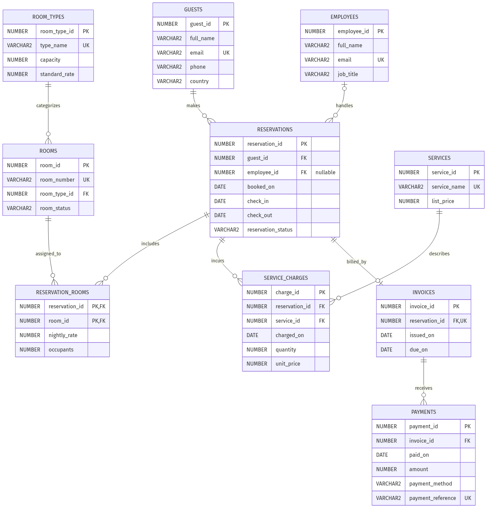

# Hotel Management System
## Database Management Systems II — Database Programming Report

**Business domain:** Hotel / Resort  
**Platform:** Oracle Database 19c or later; Oracle APEX SQL Workshop  
**Currency:** Thai baht (THB)  
**Group members:** To be completed by the submitting students.  
**Scope:** Database design and SQL programming only; no application development.

## 1. Purpose and scope

The system supports a single hotel's guest records, room inventory, reservations, service charges, invoices and payments. It replaces disconnected booking and billing records with related tables and controlled data entry. A booking can include multiple rooms, and an invoice can receive multiple payments.

The design deliberately uses exactly ten tables: the minimum specified by the supplied project instructions. Amenities, loyalty programs, multiple hotels and other optional subsystems are omitted to keep the project explainable.

**Submission warning:** The supplied instructions require a functioning Oracle APEX application, a MySQL Workbench design stage, application screenshots and a demonstration. This package intentionally supplies only the requested database/programming work and a Mermaid ERD. It is not a complete submission for the entire assignment. A Mermaid ERD does not constitute a MySQL Workbench model.

## 2. Delivered files and execution

- `hotel_management.sql`: one ordered script containing tables, constraints, indexes, sample records, views, queries, transactions, tests and optional security setup.
- `hotel_relationships.mmd`: editable Mermaid.js ER diagram source.
- `hotel_relationships.png`: rendered relationship diagram.
- `hotel_report.md`: this report.

### Running the script

1. Use a fresh Oracle schema with permission to create tables and views. The names in the script must not already exist. Each topic in this collection is an independent project: use separate schemas/workspaces, not one combined run, because topics reuse table and object names.
2. In APEX, open **SQL Workshop → SQL Scripts**, upload the SQL file, and run the complete script. PL/SQL blocks use `/` terminators.
3. Inspect every statement result and the available DBMS_OUTPUT output. Do not treat a partially completed script as a successful installation.
4. Review the row-count audit, constraint checks and zero-row diagnostic queries.
5. Leave the security flag `FALSE` on hosted APEX unless the administrator confirms permission to create database roles.

The script does not drop existing data and is not an idempotent rerun script. Oracle DDL implicitly commits, so a failed installation can leave created objects. Resolve the error in a separate clean schema rather than blindly rerunning. If using SQLcl or SQL*Plus instead, enable `SET SERVEROUTPUT ON` in the client to see test messages.

## 3. Schema and sample-data strategy

| Table | Purpose | Primary key | Seed rows |
|---|---|---|---:|
| guests | Customer identity and contact information | guest_id | 10 |
| room_types | Room category, capacity and current standard rate | room_type_id | 5 |
| rooms | Physical room inventory and operational status | room_id | 10 |
| employees | Staff who handle bookings | employee_id | 5 |
| reservations | Guest booking, dates, handler and lifecycle status | reservation_id | 12 |
| reservation_rooms | Room assignment and contracted nightly price | reservation_id + room_id | 14 |
| services | Service catalog and current list price | service_id | 5 |
| service_charges | Services purchased during a reservation | charge_id | 12 |
| invoices | Invoice identity and issue/due dates | invoice_id | 12 |
| payments | Payment receipts against invoices | payment_id | 12 |

Every master/reference table has at least five records. Every transaction/detail table has at least ten. Master records are inserted explicitly; a deterministic PL/SQL loop creates twelve two-night stays spaced four days apart. Two additional room assignments demonstrate multi-room bookings. Guests and rooms recur across different reservations. Every reservation has one service charge, one invoice and one THB 1,000 payment, leaving a balance to support receivables queries.

Sample data uses fictional identities and reserved example domains. All dates use Oracle DATE literals, avoiding dependence on session date-format settings. All sample stays are completed, so their charges represent historical billing rather than forecast income.

## 4. Entity relationships

### One-to-one relationship

`reservations → invoices` is **one to zero-or-one**. Every invoice references exactly one reservation through a non-null foreign key. A UNIQUE constraint on `invoices.reservation_id` prevents a reservation from receiving multiple invoices. A reservation may exist before it has an invoice; this optionality is intentional.

### One-to-many relationships

- A guest can make multiple reservations; each reservation belongs to one guest.
- A room type can categorize multiple rooms; each room has one room type.
- An employee can handle multiple reservations. A reservation's employee is optional because deleting a staff record sets its reference to NULL.
- A reservation can have several room assignments and service charges.
- A service can appear in many charge records.
- An invoice can have several payments; every payment belongs to one invoice.

### Many-to-many relationship

Reservations and rooms form an M:N relationship, resolved by `reservation_rooms`. A reservation may use multiple rooms, while a physical room may be booked under many reservations over time. The composite primary key prevents the same room from appearing twice within one reservation.

The database permits a reservation with zero detail rows during construction. The final diagnostic query identifies active reservations that have not yet received a room assignment. The ERD therefore uses optional-many notation rather than falsely claiming a minimum of one child is enforced.

## 5. Normalization to third normal form

### First normal form

Each column holds one value. Guests, rooms and services are not stored as comma-separated lists. A booking's multiple rooms occupy separate rows in the associative table.

### Second normal form

Single-column primary-key tables have no partial dependency on a composite key. In `reservation_rooms`, the booked nightly price and occupants describe the specific reservation-room pairing, not only the room or reservation.

### Third normal form

Non-key attributes describe the key rather than another non-key attribute:

- `room_type_id → type_name, capacity, standard_rate`; these facts belong in room_types, not in every room.
- `guest_id → full_name, email, phone, country`; reservations store only the guest reference.
- `service_id → service_name, list_price`; charges reference the service rather than duplicate its descriptive name.
- `invoice_id → reservation_id, issued_on, due_on`; invoices do not duplicate guest identity, which is available through the reservation.
- `payment_id → invoice_id, paid_on, amount, payment_method, payment_reference`.

Current catalog prices and historical transaction prices are different facts. `room_types.standard_rate` may change, but `reservation_rooms.nightly_rate` preserves the contracted price. Similarly, service `list_price` and charge `unit_price` need not remain equal.

Invoice totals, paid totals and balances are calculated in views rather than redundantly stored. This avoids updating several total columns whenever a child record changes. In a production system, finalized invoices would also need immutability or audited adjustment rules; this teaching model does not implement those controls.

## 6. Constraints and deletion rules

| Mechanism | Implemented examples | Purpose |
|---|---|---|
| PRIMARY KEY | Every table; composite reservation-room key | Stable identity and no duplicate assignments |
| FOREIGN KEY | Booking guest, room type, invoice payment | Prevent orphan records |
| NOT NULL | Names, email, dates, prices and required references | Require essential information |
| UNIQUE | Guest/employee email, room number, service name, invoice reservation, payment reference | Prevent business duplicates |
| DEFAULT | Guest country, booking status, room status, quantities, timestamps | Sensible omitted-value behavior |
| CHECK | Positive rates and amounts; capacity/occupant bounds | Reject invalid numeric values |
| CHECK | Checkout after check-in; booking date before arrival | Validate reservation dates |
| CHECK | Midnight arrival/departure dates | Ensure integral overnight counts |
| CHECK | Reservation status and payment-method lists | Enforce controlled categories |
| CHECK | Invoice due date not before issue date | Enforce invoice chronology |

`ON DELETE CASCADE` removes reservation-room and service-charge children when an eligible reservation is deleted. `ON DELETE SET NULL` preserves reservations if a referenced employee is removed. Reservations with invoices cannot be deleted, and invoices with payments cannot be deleted, because those relationships use restrictive foreign keys. This protects financial history from accidental cascade deletion.

Foreign-key indexes support common joins and parent/child operations. Primary and unique keys already have associated Oracle indexes, so redundant indexes are not added for those keys.

**Boundary:** Oracle CHECK constraints cannot express these multirow business rules directly: no overlapping bookings, occupants not exceeding the selected room type's capacity, services occurring during the stay, and payment totals not exceeding charges. Diagnostic SELECT statements identify violations, but do not prevent concurrent invalid writes. Production enforcement requires controlled procedures or carefully designed triggers and locking.

## 7. Views

### V1 — v_booking_details

Joins reservations, guests, employees, reservation_rooms, rooms and room_types. Each result row describes one room assignment with guest, employee, dates, room category, occupancy and historical room charge. Employees use a LEFT JOIN so bookings remain visible after their handler is removed.

### V2 — v_invoice_summary

Provides room charges, service charges, invoice total, paid amount and outstanding balance for each invoice. Room, service and payment records are aggregated independently before joining. This avoids the common error where two rooms multiplied by several services and payments inflate monetary totals. NVL turns missing aggregates into zero.

The room charge formula is `nightly_rate × (check_out − check_in)`. Date checks ensure whole-number nights. The balance formula is `room_total + service_total − paid_total`.

### V3 — v_top5_guests

Groups invoiced charges by guest and returns the five highest billed guests. It sorts within an inline subquery and applies `ROWNUM <= 5` outside the sort. Guest ID breaks ties deterministically. The view omits email and phone. It ranks billed value, not cash collected. A view's projection is not a substitute for restricting access to underlying tables.

## 8. Required SQL queries

| Label | Technique | Business question / expected result |
|---|---|---|
| Q1 | Multi-table JOIN ... ON through V1 | Which guest booked each room, for which dates and charge? One row per assigned room. |
| Q2 | GROUP BY and HAVING | Which guests booked at least twice? The seed repeats guests 1 and 2. |
| Q3 | Scalar subquery | Which invoices exceed the average invoice amount? |
| Q4 | Inline FROM-clause subquery | Which guests have cumulative invoiced charges above THB 5,000? |
| Q5 | Sorted inline view and ROWNUM | Which five invoices have the largest outstanding balances? |
| Q6 | ROLLUP with GROUPING() | What is room revenue by category/status, including subtotals and the grand total? |
| Q7 | Correlated NOT EXISTS | Which operational rooms have no conflicting booking for a proposed stay? |

For Q6, GROUPING distinguishes actual grouped values from subtotal rows. The seed has only CHECKED_OUT bookings, so the status and room-type subtotal values may coincide; the aggregation still demonstrates the required grouping behavior.

Q7 uses half-open date intervals: `[check_in, check_out)`. This allows a new guest to arrive on the previous guest's checkout date. It is an availability query, not an atomic booking operation. Production code must lock appropriately between availability checking and inserting a reservation.

## 9. DML and transactions

The script inserts a temporary guest and commits it. It then updates the guest's name and issues a full ROLLBACK; the following SELECT should show the original name, demonstrating that the uncommitted update was undone while the earlier committed insert persisted.

A conditional DELETE removes only that temporary guest and only if no reservation references it. The condition uses a correlated NOT EXISTS subquery. That deletion is committed, leaving no permanent demonstration record.

A separate UPDATE increases catalog rates for types with available rooms using an IN subquery. A SAVEPOINT is established first, and ROLLBACK TO restores the original rates. The final COMMIT ends the demonstration without changing seed prices. Historical booking prices would remain unchanged even if a catalog-rate update were committed.

## 10. Security

Two optional database roles are defined:

- **hm_reception:** guest and booking operations, room/catalog reads, room-assignment operations, booking view and invoice-summary reads.
- **hm_manager:** inherits reception access, can maintain services and charges, insert invoices and payments, and read the Top-5 view.

No privileges are granted to PUBLIC. Reception cannot write payments. The role setup deliberately does not grant DELETE on invoices or payments. These roles are illustrative database privileges, not a complete production access-control system. They permit broad table-level operations and do not implement per-employee or per-guest row-level security.

The PL/SQL flag `c_enable_security` defaults to FALSE. Therefore, the default run **does not create roles or apply grants** and prints a NOT RUN notice. On an authorized dedicated database, change it to TRUE before execution. Role names must be unused. An administrator must then assign roles to actual database users. APEX application usernames are not database usernames; application authorization is separate.

The optional role section contains CREATE ROLE and GRANT operations as dynamic SQL to remain executable on installations where that block must be skipped. Skipping it documents a hosted-environment limitation; it does not demonstrate successfully applied privileges.

## 11. Testing and verification status

### Checks performed during artifact preparation

- Both supplied DOCX files were read to establish the technical requirements.
- The SQL artifact was written and its existence checked; a static table-definition count found ten CREATE TABLE statements. All ten table definitions and all three view definitions were also parsed with SQLGlot using its Oracle dialect. This is static syntax checking, not Oracle execution.
- The Mermaid source was rendered successfully to a PNG.

**No Oracle database connection was available for runtime verification.** The SQL has not been executed in Oracle here. The following outcomes are test expectations, not fabricated execution results or screenshots. Students should run the script and capture their actual SQL Workshop output.

### Embedded automated tests

| Test | Expected result when run in Oracle |
|---|---|
| Duplicate guest primary key | SQLCODE -1 |
| Duplicate guest email | SQLCODE -1 |
| Missing mandatory guest name | SQLCODE -1400 |
| Room referencing missing room type | SQLCODE -2291 |
| Negative room standard rate | SQLCODE -2290 |
| Checkout equal to check-in | SQLCODE -2290 |
| Zero payment amount | SQLCODE -2290 |
| Second invoice for the same reservation | SQLCODE -1 |
| Delete a reservation with an invoice | SQLCODE -2292 |
| Delete temporary employee | Reservation survives with employee_id NULL |
| Delete temporary uninvoiced reservation | Both types of detail row are removed |

Each negative test establishes a savepoint, executes its attempted change, checks the actual SQLCODE and rolls back. Unexpected success raises an application error; unexpected failure codes are re-raised. The referential-action test checks the resulting rows and rolls back its temporary records.

### Final audit

The row-count query should match Section 3. Five diagnostic queries should each return zero rows: overlapping room bookings, exceeded capacity, out-of-stay service charges, negative invoice balances and noncancelled reservations without rooms. Final dictionary queries display constraint status and whether the three views are VALID.

Passing these tests would demonstrate the specified examples, not full production correctness. Concurrent bookings, malicious updates, cancellation workflows, refunds, posted-invoice editing and failure recovery require further tests and stronger transaction boundaries.

## 12. Requirements mapping

| Supplied database/programming requirement | Implementation |
|---|---|
| At least ten related tables | Exactly ten tables |
| One-to-one relationship | UNIQUE invoice reservation FK; optional invoice |
| Multiple one-to-many relationships | Guest/bookings, category/rooms, invoice/payments |
| Resolved many-to-many relationship | reservation_rooms |
| Third normal form | Separate entity facts and historical line prices |
| PK, FK, NOT NULL, UNIQUE, DEFAULT | Table definitions in Section 1 of script |
| At least three CHECK constraints | Date, amount, capacity, status and method checks |
| Appropriate deletion actions | CASCADE details; SET NULL staff; restrict finances |
| Minimum sample rows | Five or more masters; twelve or more transaction/details |
| Three meaningful views | Booking details, invoice aggregation, Top-5 guests |
| JOIN, GROUP BY/HAVING, subqueries | Q1–Q4 and Q7 |
| FROM subquery and ROWNUM Top-N | Q4 and Q5; Top-5 view |
| ROLLUP plus GROUPING | Q6 |
| INSERT, UPDATE, DELETE and conditional subquery | Transaction demonstrations |
| COMMIT and ROLLBACK | Full rollback and savepoint rollback |
| Defined roles and GRANT | Optional administrator-enabled block; unexecuted here |
| Constraint testing | Embedded tests and final diagnostics; execution pending |
| ERD | Mermaid source and rendered image |
| Working APEX app and screenshots | Excluded at user request |
| MySQL Workbench design artifact | Not supplied; Mermaid substituted for requested diagram |

## 13. Conclusion and division of work

The ten-table design covers the central hotel workflow while remaining manageable for an academic explanation. Referential integrity protects relationships, transaction prices preserve booking history, and correctly preaggregated views support billing analysis. The script demonstrates the required SQL techniques without building an application.

Before submission, run it on Oracle, preserve the actual test results, complete the student names and record the real division of work. A suggested allocation is **Member 1: schema, ERD, normalization and sample data; Member 2: views, advanced queries, transaction/security tests and documentation**. This is a suggested allocation, not a claim about work already performed. Both members must understand the complete implementation and disclose AI/tool assistance according to their course rules.

## 14. Source documents

1. **DB_II_Final_Project_Instructions.docx** — especially Sections 3–5 (design/implementation/programming), 8 (report), 11 (checklist), 12 (environment limitations) and 14 (integrity).
2. **Project_Assessment_Rubric.docx** — ERD, normalization, implementation, sample testing, SQL, views, transactions/security and documentation criteria.
